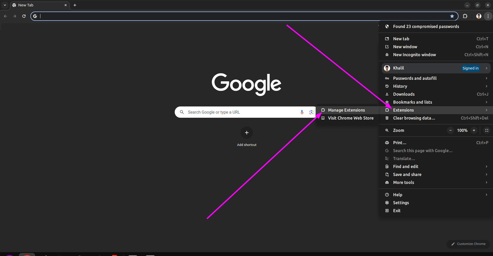

# WhatsApp Sidebar Blur

 Minimize distractions and safeguard your privacy with WhatsApp Sidebar Blur.
 
 This clever feature blurs chat previews, keeping your focus on the current conversation and hiding sensitive info from view in public settings. Enjoy a calmer, more private WhatsApp experience.

### This extension will work only for [Web WhatsApp](https://web.whatsapp.com/)

## Demo

## Why did I develop this extension ?

I communicate with most of my clients at the office via WhatsApp.

Sometimes I have to discuss clients in office meetings, in front of my boss and colleagues,
where WhatsApp conversations and information are shared.

I also use WhatsApp to communicate with my wife, friends, and family,
so I don't want any personal information to be visible during productive meetings.

## How will you use it

### At the moment, I am unable to publish this on the Chrome Web Store.

But you will use it by follow this step

Step 1 - Please retrieve this file by downloading the zip archive and then proceed to extract it onto your device.

Step 2 - Access your list of Chrome extensions and proceed to upload the extracted folder.

Step 3 - If everything is okay, you'll see something like this. Head over to WhatsApp Web and enjoy!

